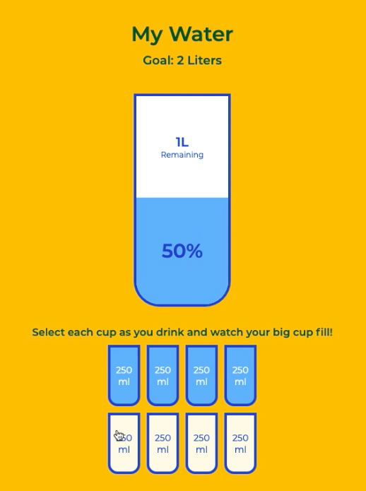

# Drink Water 
###### In this mini tutorial from 50 projects/50 days <https://www.udemy.com/course/50-projects-50-days/?src=sac&kw=50+projects> Brad Traversy walks through this build using Html, Vanilla JS and CSS. Great practice with conditionals!

 

### FULL DEMO (38secs) <https://www.youtube.com/embed/8Nj0CshnLVo> 

